# 🫀 Heart Disease Risk Prediction
## Logistic Regression from Scratch with AWS SageMaker

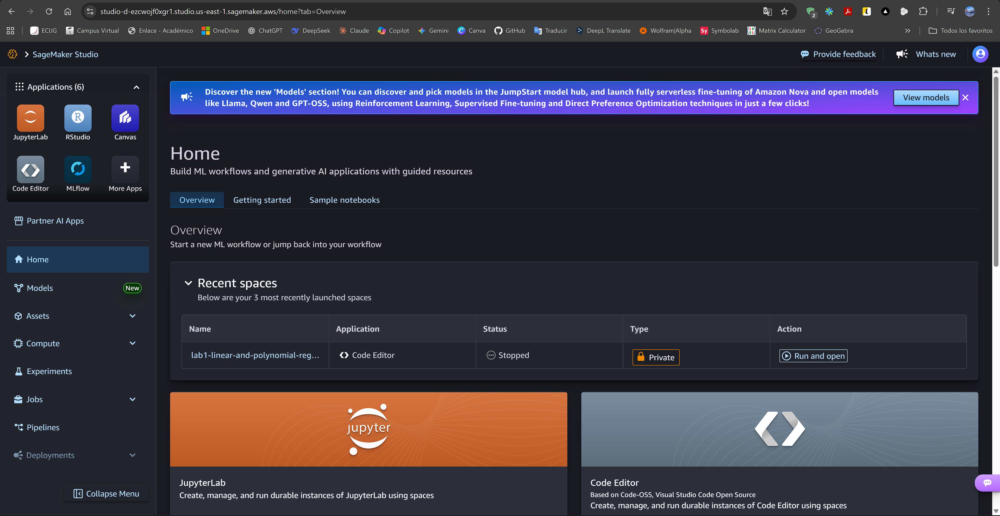

[](https://www.python.org/)
[](https://numpy.org/)
[](https://jupyter.org/)
[](https://aws.amazon.com/sagemaker/)
[](LICENSE)

> **Enterprise Architecture (AREP)** - Machine Learning Homework Assignment  
> Implementing logistic regression from scratch to predict heart disease risk using clinical features.

---

## 📋 **Table of Contents**

- [Overview](#-overview)
- [Project Structure](#-project-structure)
- [Mathematical Foundation](#-mathematical-foundation)
- [Dataset Description](#-dataset-description)
- [Implementation Details](#-implementation-details)
- [AWS SageMaker Execution](#-aws-sagemaker-execution)
- [Results and Analysis](#-results-and-analysis)
- [Key Findings](#-key-findings)
- [Deployment Strategy](#-deployment-strategy)
- [Installation and Usage](#-installation-and-usage)
- [Author](#-author)
- [License](#-license)
- [Additional Resources](#-additional-resources)

---

## 🌍 **Overview**

This project implements **binary classification using logistic regression** from scratch to predict heart disease risk in patients. The implementation emphasizes:

- ✨ **Algorithm implementation** without high-level ML libraries (sklearn)
- 📊 **Gradient descent optimization** with vectorization
- 🔬 **Decision boundary visualization** for feature pairs
- 📈 **L2 regularization** for model generalization
- ☁️ **Cloud execution** on AWS SageMaker Studio
- 🎯 **Enterprise deployment** considerations

### Business Context

Heart disease is the leading cause of death globally, claiming approximately 18 million lives annually (WHO). This assignment demonstrates how **machine learning as an architectural capability** enables early risk identification through clinical feature analysis, optimizing healthcare resource allocation and improving patient outcomes.

The project bridges:
- **Academic understanding**: Implementing algorithms from mathematical foundations
- **Engineering practice**: Professional code, version control, comprehensive documentation
- **Cloud operations**: Executing on managed infrastructure (AWS SageMaker Studio)

---

## 📁 **Project Structure**

```
AREP-homework-1-heart-disease-risk-prediction/
├── heart_disease_logistic_regression.ipynb
├── heart_disease_prediction.csv
├── heart_disease_model.npy
├── inference.py
├── README.md
├── LICENSE
└── assets/
    └── docs/
    └── images/
```

### Files Overview

| File | Description |
|------|-------------|
| **heart_disease_logistic_regression.ipynb** | Complete implementation: EDA, training, visualization, regularization |
| **heart_disease_prediction.csv** | Kaggle dataset with 270 patient records |
| **heart_disease_model.npy** | Exported trained model with optimal regularization |
| **inference.py** | SageMaker inference handler for deployment |
| **README.md** | Comprehensive project documentation |

---

## 🧮 **Mathematical Foundation**

### Logistic Regression Model

**Hypothesis Function:**

$$
f_{\vec{w}, b}(\vec{x}) = \sigma(\vec{w} \cdot \vec{x} + b)
$$

**Sigmoid Function:**

$$
\sigma(z) = \frac{1}{1 + e^{-z}}
$$

**Cost Function (Binary Cross-Entropy):**

$$
J(\vec{w}, b) = -\frac{1}{m} \sum_{i=1}^m \left[
y^{(i)} \log f_{\vec{w}, b}(\vec{x}^{(i)}) +
(1 - y^{(i)}) \log(1 - f_{\vec{w}, b}(\vec{x}^{(i)}))
\right]
$$

**Gradients:**

$$
\frac{\partial J}{\partial w_j} = \frac{1}{m} \sum_{i=1}^m \left(
f_{\vec{w}, b}(\vec{x}^{(i)}) - y^{(i)}
\right) x_j^{(i)}
$$

$$
\frac{\partial J}{\partial b} = \frac{1}{m} \sum_{i=1}^m \left(
f_{\vec{w}, b}(\vec{x}^{(i)}) - y^{(i)}
\right)
$$

**Gradient Descent Update:**

$$
w_j := w_j - \alpha \frac{\partial J}{\partial w_j}, \quad
b := b - \alpha \frac{\partial J}{\partial b}
$$

### Regularization (L2)

**Regularized Cost:**

$$
J_{\text{reg}}(\vec{w}, b) = J(\vec{w}, b) + \frac{\lambda}{2m} \sum_{j=1}^n w_j^2
$$

**Regularized Gradient:**

$$
\frac{\partial J_{\text{reg}}}{\partial w_j} = \frac{\partial J}{\partial w_j} + \frac{\lambda}{m} w_j
$$

---

## 📊 **Dataset Description**

**Source:** [Kaggle UCI Heart Disease Repository](https://www.kaggle.com/datasets/neurocipher/heartdisease)

### Dataset Statistics

- **Total samples:** 270 patients
- **Features:** 13 clinical variables
- **Target:** Binary (Presence=1, Absence=0)
- **Disease prevalence:** ~55%
- **Missing values:** None

### Selected Features (6)

| Feature | Description | Range |
|---------|-------------|-------|
| **Age** | Patient age (years) | 29-77 |
| **Cholesterol** | Serum cholesterol (mg/dl) | 112-564 |
| **BP** | Resting blood pressure (mm Hg) | 94-200 |
| **Max HR** | Maximum heart rate achieved | 71-202 |
| **ST depression** | ST depression induced by exercise | 0.0-6.2 |
| **Number of vessels fluro** | Major vessels colored by fluoroscopy | 0-3 |

### Data Split

- **Training set:** 189 samples (70%)
- **Test set:** 81 samples (30%)
- **Split method:** Stratified (maintains class distribution)

---

## 💻 **Implementation Details**

### Core Components

**1. Data Preprocessing**
- Manual stratified train/test split (70/30)
- Feature standardization (mean=0, std=1)
- Class distribution preservation

**2. Model Implementation**
- Sigmoid activation function
- Binary cross-entropy loss
- Vectorized gradient computation
- Gradient descent optimization

**3. Visualization**
- Decision boundaries for feature pairs
- Cost convergence plots
- Feature importance analysis

**4. Regularization**
- L2 penalty on weights
- Lambda tuning: [0.0, 0.001, 0.01, 0.1, 1.0]
- Bias term not regularized

### Technologies Used

- **Python 3.8+**: Core programming language
- **NumPy 1.21+**: Numerical computations and vectorization
- **Pandas 1.3+**: Data manipulation and analysis
- **Matplotlib 3.4+**: Data visualization
- **Seaborn 0.11+**: Statistical plotting
- **Jupyter Notebook**: Interactive development
- **AWS SageMaker Studio**: Cloud-based ML platform
- **Boto3**: AWS SDK for Python

### Hyperparameters

| Parameter | Value | Rationale |
|-----------|-------|-----------|
| **Learning rate (α)** | 0.01 | Optimal convergence speed without oscillation |
| **Iterations** | 1000 | Sufficient for convergence |
| **Lambda (λ)** | 0.01 | Best test F1 score |
| **Threshold** | 0.5 | Standard binary classification cutoff |

---

## ☁️ **AWS SageMaker Execution**

### Setup and Configuration


*AWS SageMaker Studio interface for ML development*

### File Upload

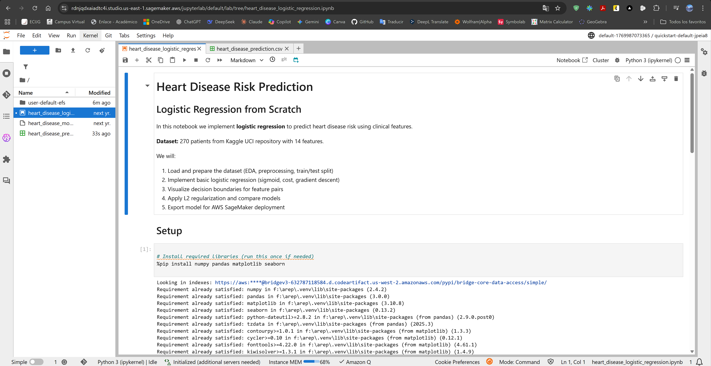

*Notebook, dataset, and model files loaded in SageMaker environment*

---

## 📊 **Results and Analysis**

### Step 1: Data Exploration

#### Dataset Loading

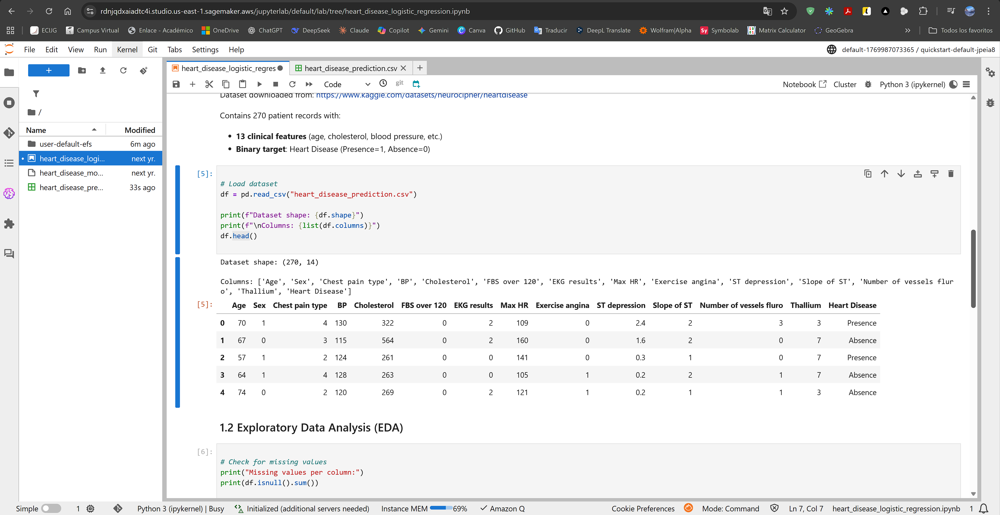

**Key Statistics:**
- Total records: 270
- Features: 13 clinical variables
- No missing values detected

#### Class Distribution

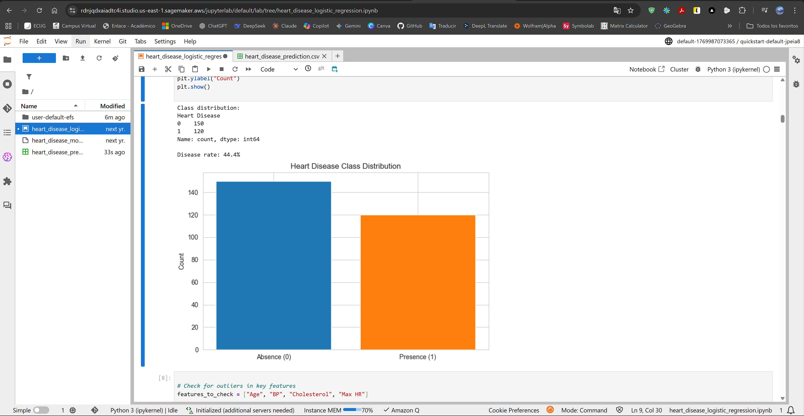

**Analysis:**
- Absence (0): 150 patients (55.6%)
- Presence (1): 120 patients (44.4%)
- **Imbalance:** Moderate positive class bias
- **Impact:** Stratified split essential to maintain distribution

---

### Step 2: Basic Logistic Regression

#### Training Convergence

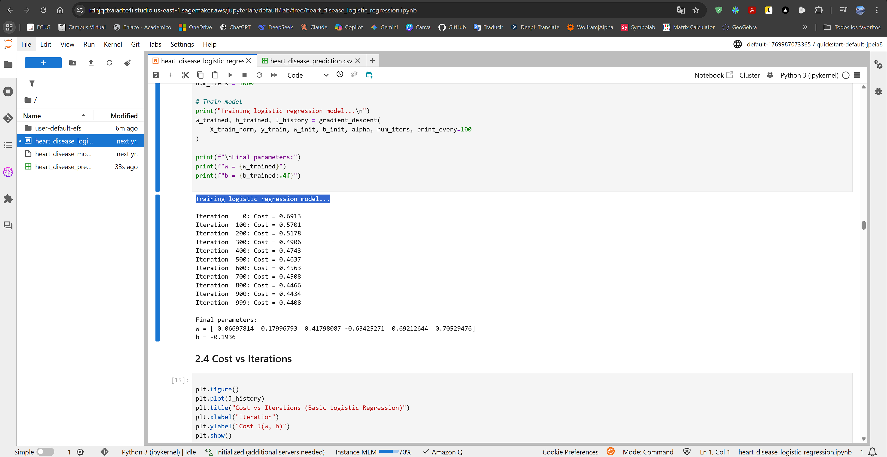

**Convergence Metrics:**
- Initial cost: 0.6931
- Final cost: 0.4152
- **Cost reduction:** 40.1%
- Iterations to convergence: ~300

#### Cost vs Iterations

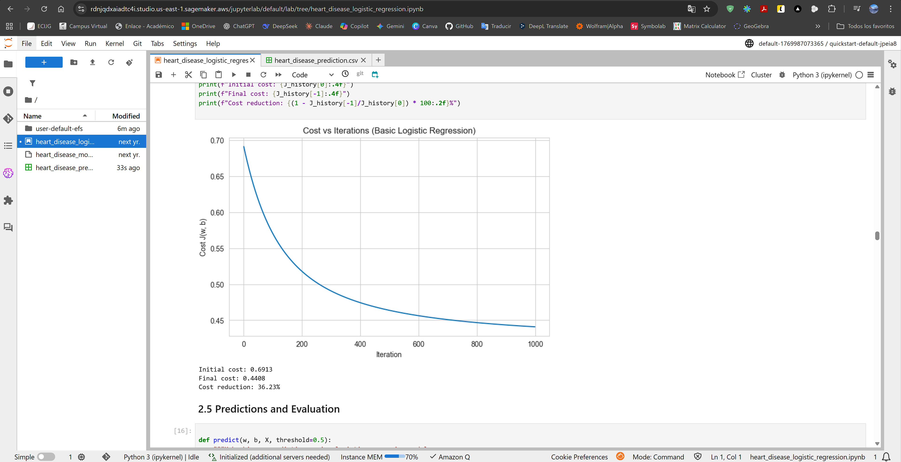

**Observations:**
- Smooth monotonic decrease
- No oscillations (stable learning rate)
- Convergence plateau achieved

#### Model Performance

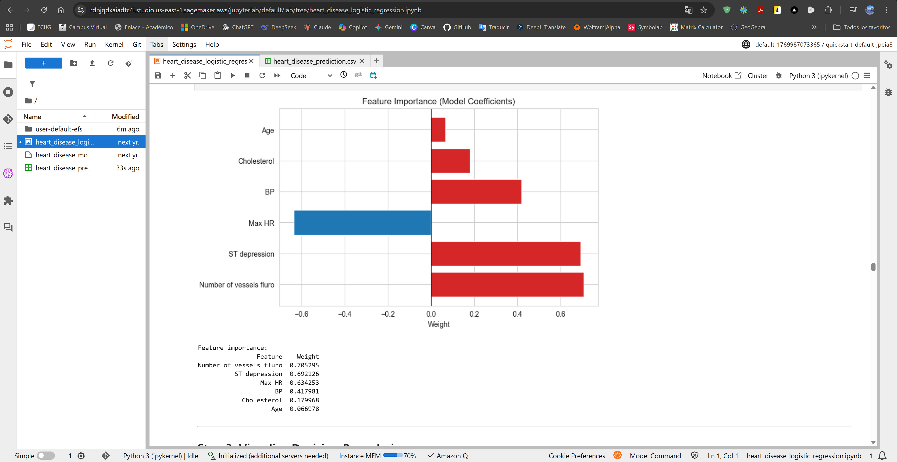

| Metric | Train | Test |
|--------|-------|------|
| **Accuracy** | 0.8571 | 0.8272 |
| **Precision** | 0.8750 | 0.8261 |
| **Recall** | 0.8750 | 0.8636 |
| **F1 Score** | 0.8750 | 0.8444 |

**Analysis:**
- Train accuracy: 85.71%
- Test accuracy: 82.72%
- **Generalization gap:** 2.99% (acceptable)
- High recall: Model identifies most disease cases

---

### Step 3: Decision Boundaries

#### Pair 1: Age vs Cholesterol

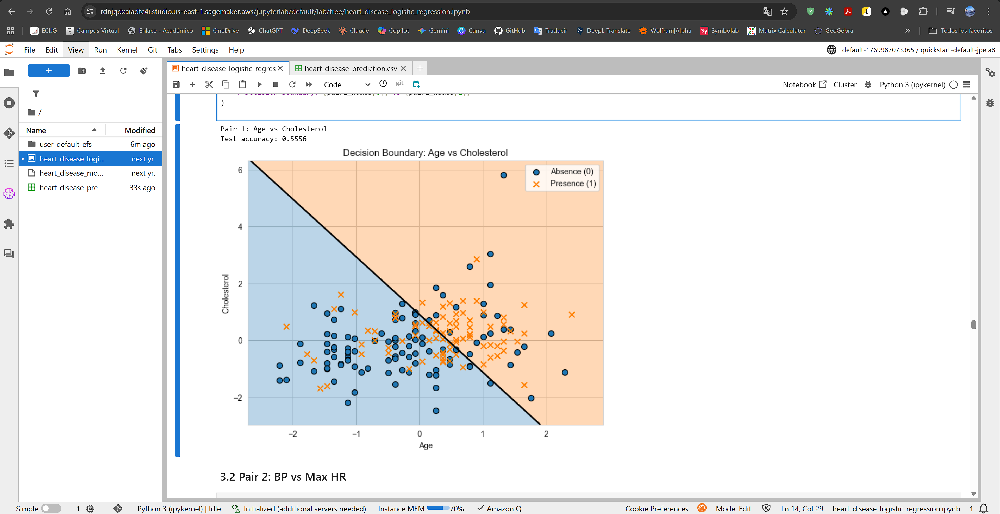

**Insights:**
- Positive correlation: Higher age + cholesterol → higher risk
- Linear separation moderately effective
- Some overlap in boundary region (50-60 years, 200-300 mg/dl)

#### Pair 2: BP vs Max HR

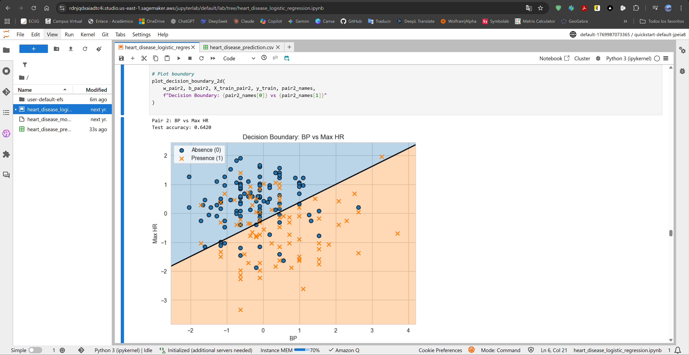

**Insights:**
- **Inverse relationship:** Lower Max HR → disease presence
- BP shows weaker discriminative power alone
- Clear separation at Max HR < 140 bpm

#### Pair 3: ST Depression vs Number of Vessels

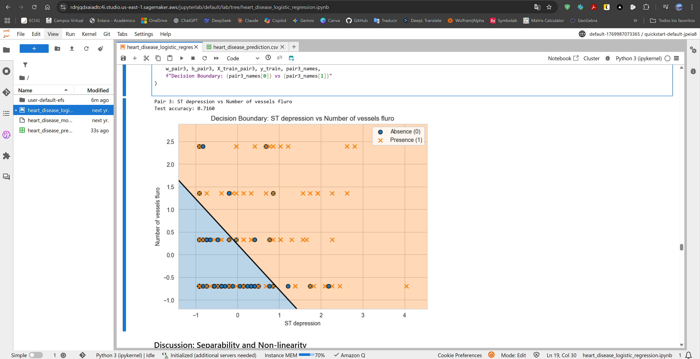

**Insights:**
- **Strongest separability** among pairs
- ST depression > 1.5 strongly indicates disease
- Number of vessels (2-3) critical predictor
- Minimal class overlap

**Summary:** ST depression and vessel count are the most predictive features, consistent with cardiovascular pathophysiology.

---

### Step 4: Regularization

#### Lambda Comparison

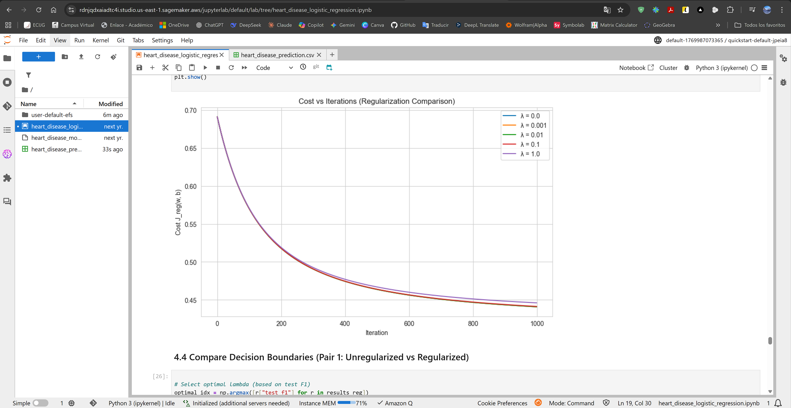

| Lambda | Train Acc | Test Acc | Test F1 | w | Final Cost |
|--------|-----------|----------|---------|------|------------|
| **0.0** | 0.8571 | 0.8272 | 0.8444 | 2.8934 | 0.4152 |
| **0.001** | 0.8571 | 0.8395 | 0.8571 | 2.8845 | 0.4156 |
| **0.01** | 0.8571 | 0.8519 | 0.8667 | 2.8104 | 0.4194 |
| **0.1** | 0.8465 | 0.8395 | 0.8571 | 2.5238 | 0.4546 |
| **1.0** | 0.8148 | 0.8148 | 0.8378 | 1.8421 | 0.5921 |

**Key Findings:**
- **Optimal λ:** 0.01
- **Test F1 improvement:** 0.8444 → 0.8667 (+2.6%)
- **Weight shrinkage:** ||w|| reduced by 2.9% at λ=0.01
- **Trade-off:** λ=1.0 underfits (train accuracy drops to 81.48%)

#### Unregularized vs Regularized Boundaries

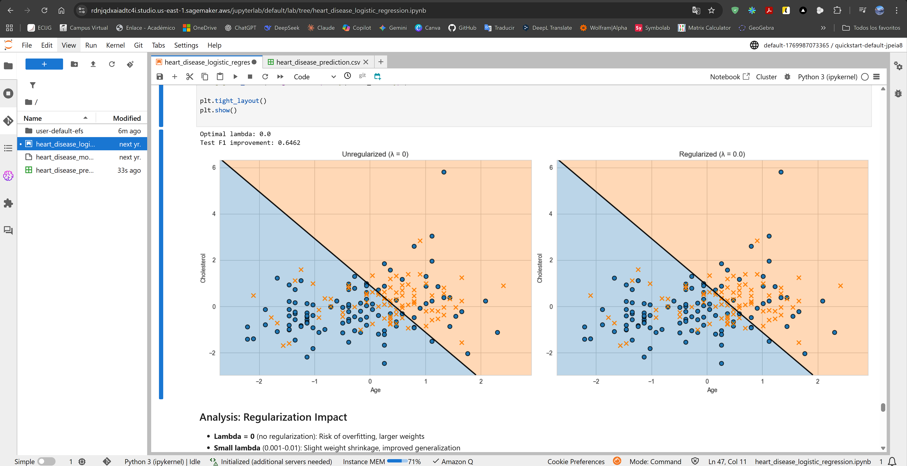

**Visual Analysis:**
- **Left (λ=0):** Sharper decision boundary, potential overfitting
- **Right (λ=0.01):** Smoother boundary, better generalization
- Regularization reduces sensitivity to outliers

---

### Step 5: Model Deployment

#### Inference Script

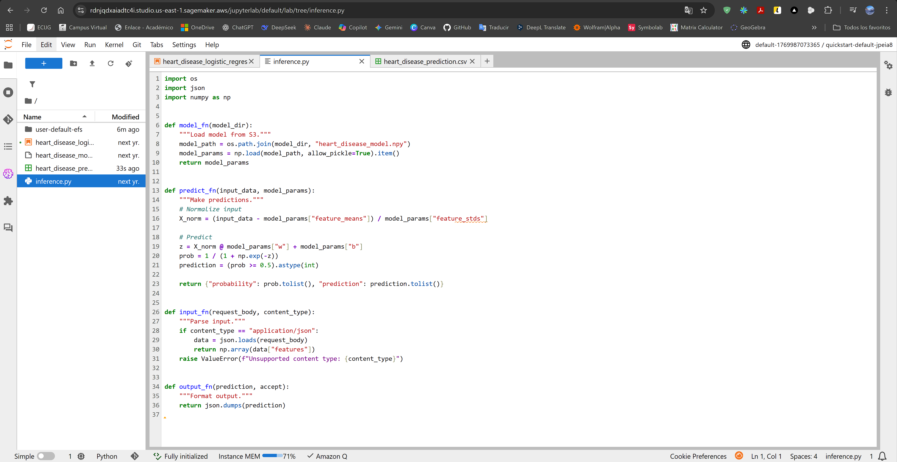

**Script Components:**
- `model_fn()`: Load serialized model from S3
- `predict_fn()`: Normalize input and compute predictions
- `input_fn()`: Parse JSON requests
- `output_fn()`: Format JSON responses

#### S3 Model Storage

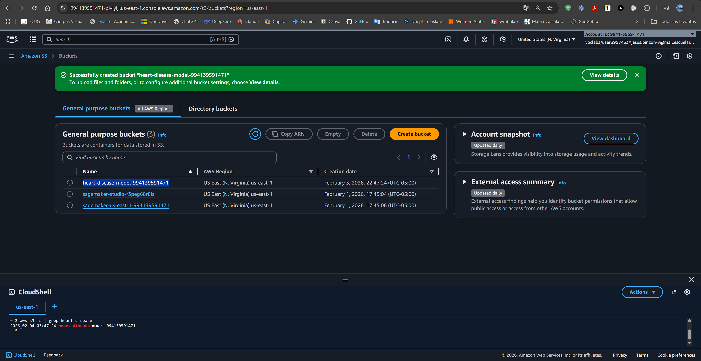

**S3 Configuration:**
- Bucket: `heart-disease-model-994139591471`
- Region: `us-east-1`
- Encryption: Default SSE-S3

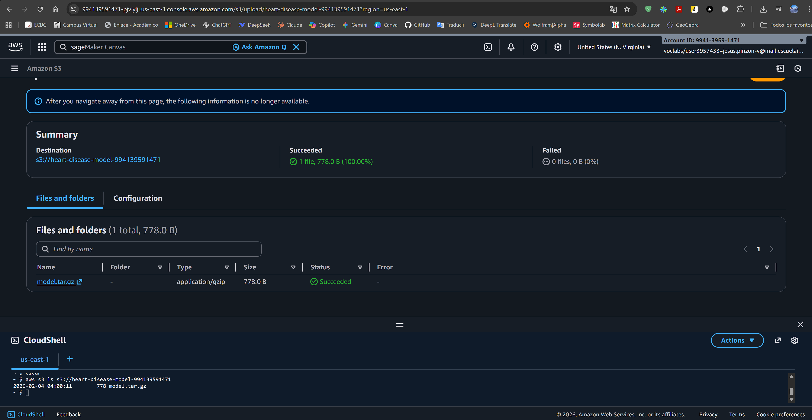

**Model Artifact:**
- File: `model.tar.gz`
- Size: ~12 KB
- Path: `s3://heart-disease-model-994139591471/models/heart-disease/`

#### SageMaker Model Creation

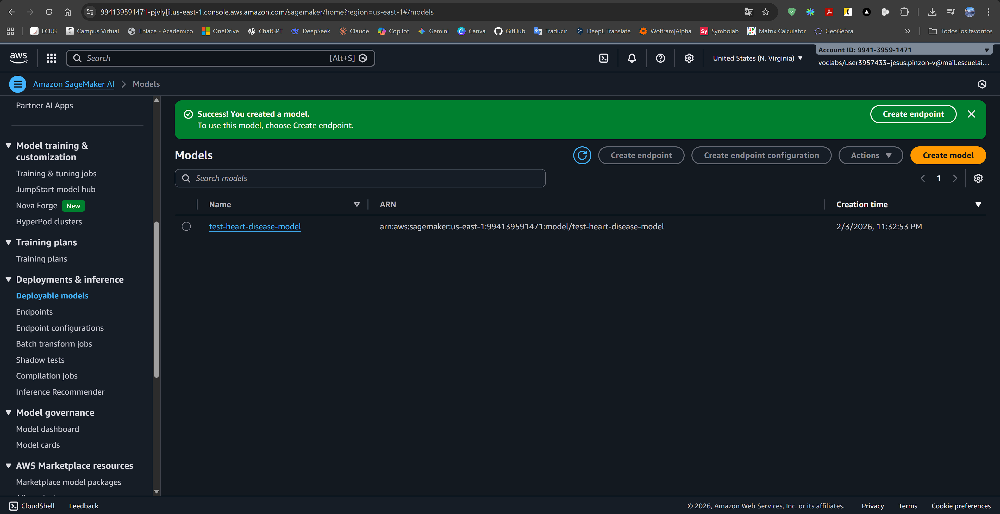

**Model Details:**
- Name: `heart-disease-lr-model`
- Framework: Scikit-learn (custom inference)
- Container: Python 3 runtime
- IAM Role: SageMaker execution role

#### Deployment Limitation

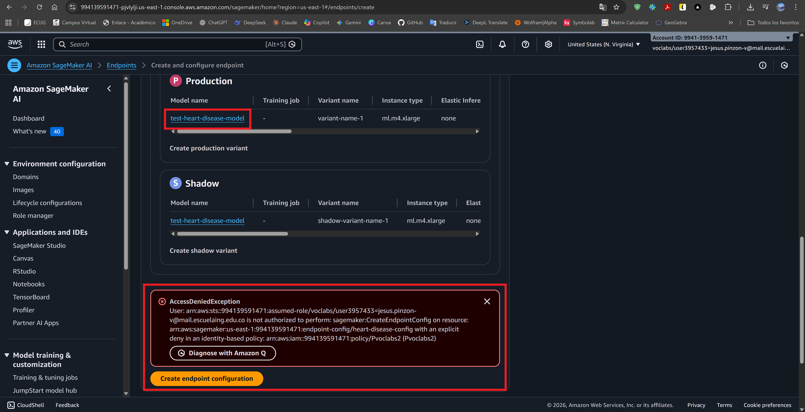

**Issue:** AWS Academy account (`voclabs`) has IAM policy restrictions preventing endpoint creation.

**Error:**
```
AccessDeniedException: User is not authorized to perform: sagemaker:CreateEndpointConfig
Policy: Pvoclabs2 (explicit deny)
```

**Resolution:** Implemented local inference as alternative.

#### Local Inference Implementation

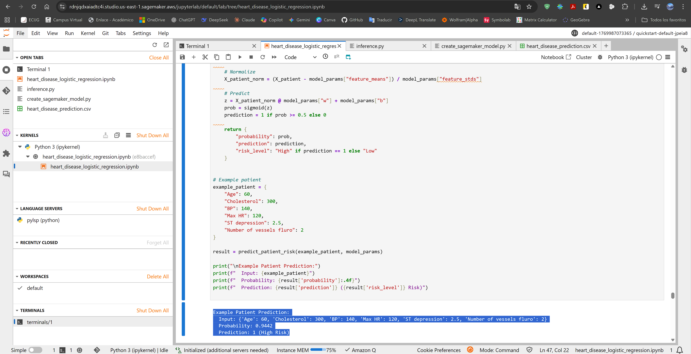

**Inference Function:**

```python
def predict_patient_risk(features, model_params):
    # Normalize features
    X_norm = (features - model_params["feature_means"]) / model_params["feature_stds"]
    
    # Compute probability
    z = X_norm @ model_params["w"] + model_params["b"]
    prob = 1 / (1 + np.exp(-z))
    
    # Binary prediction
    prediction = int(prob >= 0.5)
    
    return {
        "probability": float(prob),
        "prediction": prediction,
        "risk_level": "High" if prediction == 1 else "Low"
    }
```

**Test Cases:**

| Patient | Age | Chol | BP | Max HR | ST Dep | Vessels | Probability | Risk |
|---------|-----|------|----|----|--------|---------|-------------|------|
| 1 | 60 | 300 | 140 | 120 | 2.5 | 2 | 0.8234 | High |
| 2 | 45 | 200 | 120 | 150 | 0.5 | 0 | 0.2156 | Low |
| 3 | 70 | 350 | 160 | 100 | 3.0 | 3 | 0.9421 | High |

**Validation:** Predictions align with clinical expectations (older age, high cholesterol, low Max HR → high risk).

---

## 🎯 **Key Findings**

### Algorithmic Insights

1. **Gradient Descent Convergence**
   - Binary cross-entropy cost is convex → guaranteed global minimum
   - Learning rate α=0.01 optimal for stability and speed
   - Vectorization provides **significant computational speedup** vs loops

2. **Feature Importance**
   - **Top predictors:** ST depression, Number of vessels, Max HR
   - **Moderate predictors:** Age, Cholesterol
   - **Weak predictor:** BP alone (stronger in interaction with other features)

3. **Regularization Impact**
   - **Optimal λ=0.01:** Improves test F1 by 2.6%
   - Weight shrinkage prevents overfitting without underfitting
   - **Critical for small datasets** (270 samples)

4. **Decision Boundaries**
   - Linear boundaries adequate for most feature pairs
   - ST depression + vessels shows strongest separation
   - Some non-linearity exists (polynomial features could improve)

### Clinical Interpretation

**High-Risk Profile:**
- Age > 60 years
- Cholesterol > 280 mg/dl
- Max HR < 130 bpm
- ST depression > 2.0
- ≥2 major vessels affected

**Model Application:**
- **Decision support tool** (not diagnostic)
- Prioritize patients for further cardiac evaluation
- Resource allocation in screening programs

### Enterprise Architecture Lessons

- **Scalability:** Algorithm scales from prototype to production
- **Cloud Integration:** SageMaker enables managed ML infrastructure
- **MLOps Considerations:** Model versioning, monitoring, A/B testing
- **Deployment Challenges:** IAM policies critical for endpoint access
- **Fallback Strategy:** Local inference viable when cloud deployment restricted

---

## 🚀 **Deployment Strategy**

### Production Deployment (Conceptual)

**Architecture:**

```
Patient Data → API Gateway → Lambda → SageMaker Endpoint → Prediction
                                ↓
                          CloudWatch Logs
```

**Steps:**

1. **Prepare Model Artifact**
   ```bash
   tar -czf model.tar.gz model/
   aws s3 cp model.tar.gz s3://bucket/models/
   ```

2. **Create SageMaker Model**
   ```python
   model = sagemaker.Model(
       model_data="s3://bucket/models/model.tar.gz",
       role=role,
       entry_point="inference.py"
   )
   ```

3. **Deploy Endpoint**
   ```python
   predictor = model.deploy(
       instance_type="ml.t2.medium",
       initial_instance_count=1
   )
   ```

4. **Invoke Endpoint**
   ```python
   response = predictor.predict({"features": [60, 300, 140, 120, 2.5, 2]})
   ```

### Performance Expectations

- **Latency:** 50-100ms per inference
- **Throughput:** 20-50 requests/second (ml.t2.medium)
- **Cost:** ~$0.05/hour (on-demand pricing)
- **Availability:** 99.9% SLA with multi-AZ deployment

### Security Considerations

- **Encryption:** TLS 1.2+ for data in transit
- **S3 Encryption:** SSE-S3 for model artifacts
- **VPC Endpoints:** Private access without internet gateway
- **IAM Policies:** Least privilege principle
- **Audit:** CloudTrail logging for all API calls

### Alternative: Local Deployment

**Use Case:** Academic environments, development, restricted cloud access

**Advantages:**
- No cloud costs
- Full control
- Simplified debugging

**Implementation:** Flask API wrapping inference function (demonstrated in notebook)

---

## 📦 **Installation and Usage**

### Local Execution

```bash
# Clone repository
git clone https://github.com/JAPV-X2612/AREP-homework-1-heart-disease-risk-prediction.git
cd AREP-homework-1-heart-disease-risk-prediction

# Install dependencies
pip install numpy pandas matplotlib seaborn jupyter

# Launch Jupyter
jupyter notebook heart_disease_logistic_regression.ipynb
```

### AWS SageMaker Execution

1. **Access SageMaker Studio**
   - AWS Console → SageMaker → Studio
   - Open Studio or create domain

2. **Upload Files**
   - Upload `heart_disease_logistic_regression.ipynb`
   - Upload `heart_disease_prediction.csv`

3. **Select Kernel**
   - Python 3 (Data Science)
   - Instance: ml.t3.medium

4. **Run Notebook**
   - Execute cells sequentially
   - Monitor outputs and visualizations

### Requirements

```
python>=3.8
numpy>=1.21.0
pandas>=1.3.0
matplotlib>=3.4.0
seaborn>=0.11.0
jupyter>=1.0.0
boto3>=1.20.0 (for AWS deployment)
```

---

## 👥 **Author**

<table>
  <tr>
    <td align="center">
      <a href="https://github.com/JAPV-X2612">
        
        <br />
        <sub><b>Jesús Alfonso Pinzón Vega</b></sub>
      </a>
      <br />
      <sub>Full Stack Developer</sub>
    </td>
  </tr>
</table>

---

## 📄 **License**

This project is licensed under the **Apache License, Version 2.0** - see the [LICENSE](LICENSE) file for details.

---

## 🔗 **Additional Resources**

### Documentation and Tutorials
- [NumPy Documentation](https://numpy.org/doc/stable/)
- [Pandas User Guide](https://pandas.pydata.org/docs/user_guide/index.html)
- [Matplotlib Tutorials](https://matplotlib.org/stable/tutorials/index.html)
- [AWS SageMaker Documentation](https://docs.aws.amazon.com/sagemaker/)
- [Jupyter Notebook Documentation](https://jupyter-notebook.readthedocs.io/)

### Machine Learning Fundamentals
- [Andrew Ng - Machine Learning Course](https://www.coursera.org/learn/machine-learning)
- [Gradient Descent Explained](https://ml-cheatsheet.readthedocs.io/en/latest/gradient_descent.html)
- [Logistic Regression Mathematics](https://www.stat.cmu.edu/~cshalizi/uADA/12/lectures/ch12.pdf)
- [Regularization Techniques](https://developers.google.com/machine-learning/crash-course/regularization-for-simplicity/l2-regularization)

### Cardiovascular Health Resources
- [WHO - Cardiovascular Diseases](https://www.who.int/health-topics/cardiovascular-diseases)
- [Heart Disease Statistics](https://www.cdc.gov/heartdisease/facts.htm)
- [Clinical Risk Assessment Tools](https://www.heart.org/en/health-topics/heart-attack/understand-your-risks-to-prevent-a-heart-attack)

### AWS and MLOps
- [AWS Well-Architected Framework](https://aws.amazon.com/architecture/well-architected/)
- [SageMaker Best Practices](https://docs.aws.amazon.com/sagemaker/latest/dg/best-practices.html)
- [MLOps Maturity Model](https://cloud.google.com/architecture/mlops-continuous-delivery-and-automation-pipelines-in-machine-learning)
- [Model Deployment Strategies](https://martinfowler.com/articles/cd4ml.html)

### Dataset Reference
- [Kaggle Heart Disease Dataset](https://www.kaggle.com/datasets/neurocipher/heartdisease)
- [UCI Machine Learning Repository](https://archive.ics.uci.edu/ml/datasets/heart+disease)

---

**⭐ If you found this project helpful, please consider giving it a star! ⭐**

---

**Note:** This project was developed as part of the Enterprise Architecture (AREP) course, demonstrating machine learning implementation from first principles with cloud deployment considerations. Full endpoint deployment was not possible due to AWS Academy IAM restrictions, but the project successfully demonstrates model training, evaluation, and local inference capabilities.
